# できるだけコードを書かないQt
## QtChart
今回もqtDesignerを使用してできるだけマウス用いてチャートを表示できる方法を勉強しましょう．
[QtChatrs](https://doc.qt.io/qt-5.10/qtcharts-index.html)はいろいろなグラフを表示するため
のモジュールです．どんなグラフを表示できるかは[ここ](https://doc.qt.io/qt-5.10/qtcharts-examples.html)を見てください．いろいろなサンプルがあり明日．綺麗なグラフを作成することが可能です．
QtChartsはＱｔのサイトには下記のように紹介されています．

>Qt Charts モジュールは簡単に使えるチャートコンポーネンツを提供します．
>それは，Qt Graphics View Frameworkを使用しています．
>ですので,簡単にモダンなユーザーインターフェースに統合可能です．
>Qt ChartsはQWidges,QGraphicsWidget,もしくはQMLとして使用することが可能です．
>ユーザはチャートのテーマを選ぶことによって簡単に魅力的なチャートを作成できます．

## 今回の目標


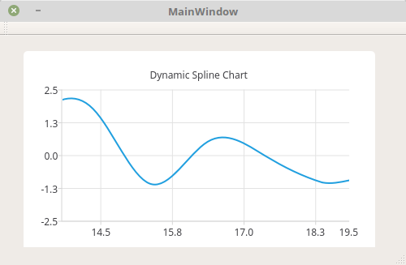

今回作成するグラフは，リアルタイムにデータを逐次更新していくグラフです．
Qtでグラフを表示するためには以下の４つのクラスを使用します．
- QtCharts::QChartView
- QtCharts::QChart
- QtCharts::QSplineSeries
- QtCharts::QValueAxis

それぞれのクラスの関係性は以下の図のようになっています．

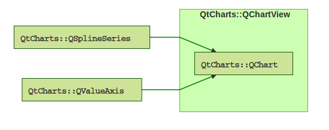

- **QtCharts::QSplineSeries** 表示する点の座標データをこのクラスに格納します．　名前の通り，スプライン補間をおこなってくれます．
    QSplineSeriesの他にも，チャートタイプは
	- Line and spline charts
	- Area and scatter chatrs
	- Bar charts
	- Pie charts
	- Box-and-whiskers charts
	- Candlestick charts
	- Polar charts
	があります．
	以下のように，チャートはこれらのクラスのインスタンスをQChartかQChartViewクラスに渡すことによって作成されます．
	```cpp
	QLineSeries* series = new QLineSeries();
	series->add(0, 6);
	series->add(2, 4);
	...
	chartView->chart()->addSeries(series);
	chartView->chart()->createDefaultAxis();
	```

- **QtChatrs::QValueAxis** 軸の設定を行い，QChart->setAxisX(QCalueAxis, QSplineSeries)
とかやると軸の設定が反映されます．
しかし，描画範囲を決めるだけであればQChartView->QChart()->axisX()->setRange(min, max)を
使用したほうが早いです． ではいつ使うかというと， グラフ中の目盛りの数とかを設定するときに使用します．
	QValueAxisの他にも，軸のクラスは
	- Category axis
	- Var category axis
	- Date-time axis
	- Logarithmic value axis
	があります．
	これらのクラスを使用することでtickマーカ（目盛りのこと），
	グリッドライン，そして影の設定をすることが可能です．

- **QtCharts::QChart** グラフの座標のデータ以外の設定を，このクラスで行います．たとえば，グラフのタイトル,アニメーション表示の設定とかを設定することができます．
	QGraphicsSceneクラスの中で表示させるのでなければ，QChartクラスを
	直接宣言して使用することはありません．QChartViewクラスを代わりに使用します．
	QChartViewクラスはQGraphicsSceneクラスと併用しなくてもチャートを作成することが
	可能な便利なお助けクラスです．そのため，QChartクラスは本稿では直接使用しません．
	そのかわり，チャートの関するあれこれは，QChartViewクラスに含まれているQChartクラスを
	使用します．

- **QtCharts::QChatrView** qtdesigner上でQGraphics Viewクラスを格上げして作ります． グラフ描画に関する全部を統括するクラスです．
	QGraphicsSceneクラスと併用しなくても，QChartViewクラスだけで
	チャートを作成することができます．本稿ではチャートを随時更新する
	などの複雑な処理を行うため，QChartViewクラス以外のクラスも使用しますが
	一般的なデータの更新を行わないようなチャートを使用する分には
	このクラスだけで十分であり，例えば，軸設定に関してもQValueAxisクラスなどを宣言し
	使用する必要はなく，QChartViewクラスに含まれている軸設定メソッドを
	使用することにより軸の設定を行うことができます．

##　作成
### 1. プロジェクト作成
Qt Createrを立ち上げ，左上の方にあるプロジェクト作成をクリックしてください．
あとは，以下の写真にしたがってよしなに設定してください．

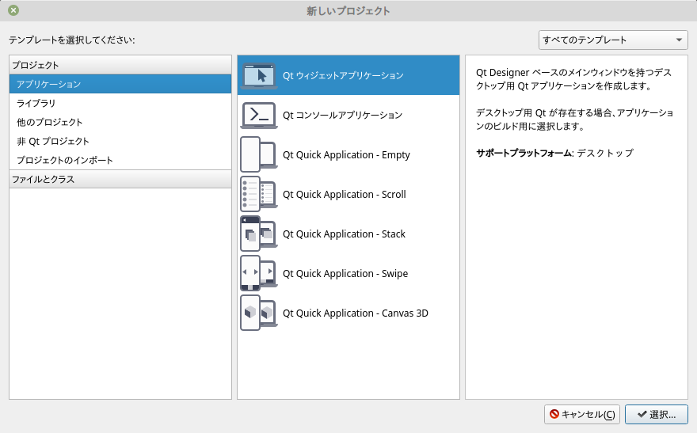

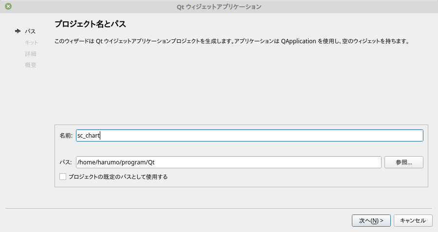

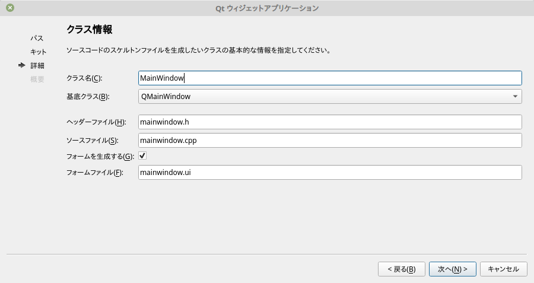

### GUI作成
左側のタブからデザインをクリックしてください．
次に左側のウィジェット一覧から**Graphics View**をドラッグ＆ドロップして
メインウィンドウに貼り付けてください．ちなみに，Graphics Viewはウィジェット一覧のDisplay Widgetsの
項目にあります．筆者はこれが見つからなくて精神を消耗しました．

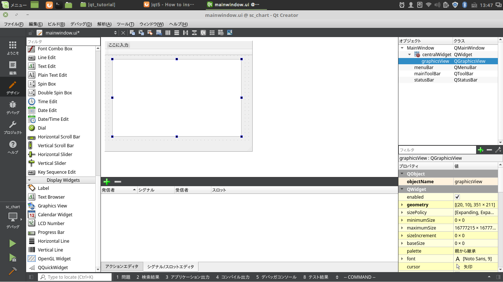

次に，**Graphics View**クラスを**格上げ**という操作によって，**QtCharts::QChartView**に
変化させます．　まず，メインウィンドウに先ほど貼り付けた**Graphics View**上で右クリックします．
右クリックで現れるメニューから**格上げ先を指定**を選択します．

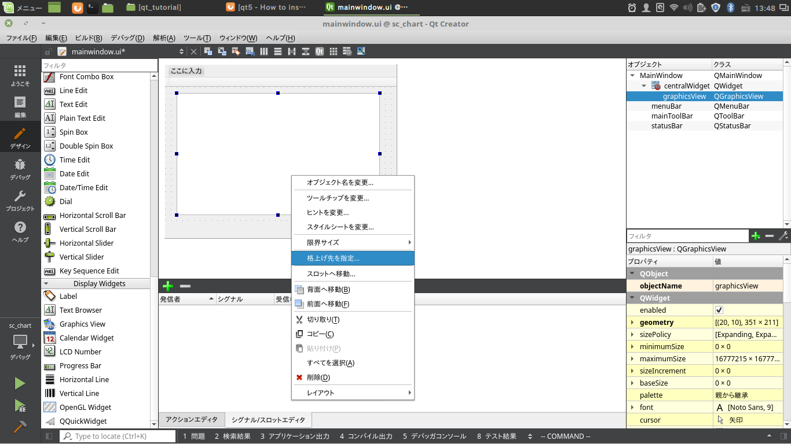

そうすると，下のような格上げ先を指定するウィンドウが表示されるので，

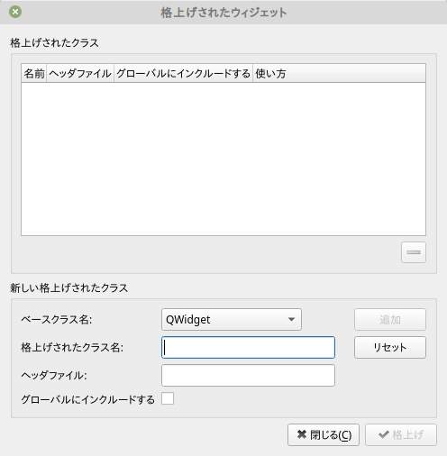

- ベースクラス名
- 格上げされたクラス名
- ヘッダファイル
を下の図のように設定し，追加ボタンを押した後，格上げボタンを押してください．

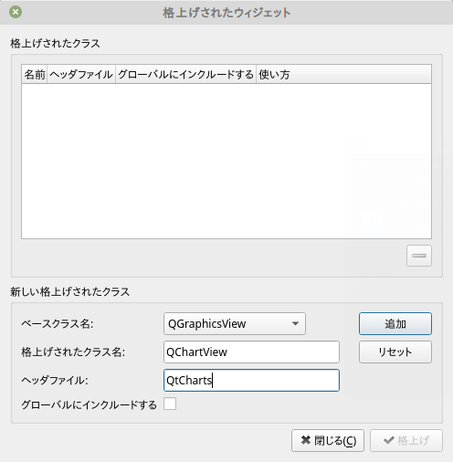

これで，先ほどメインウィンドウに貼り付けた**Graphics View**クラスは**QtCharts::QChartView**クラス
になりました．

最後にQChartViewクラスのオブジェクト名を変更しましょう．
どういうことかというと，現在は
```cpp
QChartView QChartView;
```
となっていて，クラスの名前とインスタンスの名前が同じです．
これだと，混乱するので，インスタンスの名前を好きな名前（今回は，my_chart_view)に変更します．
まず，右の**オブジェクト一覧**からQChartViewを選択します．そうすると，QChartViewクラスのオプション一覧が
画面右下の方に表示されますので，その中の**objectName**のところをダブルクリックして編集します．
つまり，下の図のようにしてください．

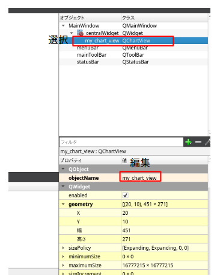


### .pro [設定ファイルの修正]
左側のタブから編集をクリックしてソースコードを編集しましょう．
最初は設定ファイルを編集します．　ライブラリなどを.proファイルに追加しましょう．
ヘッダーやcppファイルなどがあるファイル一覧から.proファイルを開きます．
今回，QtChartsという名前のライブラリを使用するので，下の図のような感じで,.proファイルを編集します．


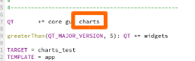

うまくい編集できていれば，ほとんど変化していませんが，下記のようになっていると思います．

```cpp
#-------------------------------------------------
#
# Project created by QtCreator 2018-05-26T13:25:19
#
#-------------------------------------------------

QT       += core gui charts

greaterThan(QT_MAJOR_VERSION, 4): QT += widgets

TARGET = sc_chart
TEMPLATE = app

# The following define makes your compiler emit warnings if you use
# any feature of Qt which has been marked as deprecated (the exact warnings
# depend on your compiler). Please consult the documentation of the
# deprecated API in order to know how to port your code away from it.
DEFINES += QT_DEPRECATED_WARNINGS

# You can also make your code fail to compile if you use deprecated APIs.
# In order to do so, uncomment the following line.
# You can also select to disable deprecated APIs only up to a certain version of Qt.
#DEFINES += QT_DISABLE_DEPRECATED_BEFORE=0x060000    # disables all the APIs deprecated before Qt 6.0.0


SOURCES += \
        main.cpp \
        mainwindow.cpp

HEADERS += \
        mainwindow.h

FORMS += \
        mainwindow.ui
```

## mainwindow.h
mainwindow.hでは，チャートを描画するために，先ほど説明した描画に必要な３つのクラス
(QSplineSeries, QValueAxis, QChartView)と定期的にチャートの値を更新するための
トリガーとしてQTimerクラスをMainWindowクラスの要素として宣言します．

### 1 ヘッダファイルのインクルード
mainwindow.hの４行目付近から，下記のコードを貼り付けてください．
```cpp
#include <QtCharts/QChartView>
#include <QtCharts/QSplineSeries>
#include <QtCharts/QValueAxis>
#include <QtCore/QTimer>
#include <random>
```
標準ライブラリのrandomはランダムにチャートのデータを生成するために後々使用します．

### 2 クラスの宣言
描画に必要な３つのクラスとQTimerクラスをMainWindowクラスのprivate変数として宣言しましょう．
具体的には２５行目付近に下記を貼り付けてください．

```cpp
	QTimer* timer;		//In order to use animation, timer class call handleTimeout() class method every one second.
    QtCharts::QSplineSeries* series;	//series class keep the actual datas.
    QtCharts::QValueAxis* axis;			//The information regarding to x axis.
    qreal x;							//x of next (x,y)
    qreal y;							//y of next (x,y)
```

### 3 スロットの宣言
タイマーが呼ばれるごとに処理を行う関数の宣言を書きましょう．
具体的には，３１行め付近に下記のコードを貼り付けてください．
```cpp
public slots:
    void handleTimeout();
};
```
これは，スロットと呼ばれるＱｔ独自の特別な関数です．
難しいことは何もなくて，端的に言えば，コールバック関数です．
今回，このコールバック関数はタイマーによって定期的に呼びだされます．

## mainwindow.cpp
先ほど，クラスやスロット関数の宣言をmainwindow.hで行いましたが，
その実装をmainwindow.cppに書いていきます．

### 1 初期化
まず，先ほどのクラスをインスタンス化します．
Qtでは伝統的に各クラスはポインタとして管理するので，インスタンス化する部分は見慣れないかもしれません．

１２行め付近に下記のコードを貼り付けてください．
```cpp
    //Initialize
    this->axis 		   = new QtCharts::QValueAxis();
    this->series       = new QtCharts::QSplineSeries();
    this->timer        = new QTimer();
    this->x            = 2.5;
    this->y            = 2.5;
```
this->x, this->yはデータの点座標を表す関数です．初期化時は最初の点として(2.5, 2.5)
を筆者の気分で入れました．無くても問題ありません．

### 2 QSplineSeriesをChartViewクラスに追加
先ほど，(x,y)に(2.5, 2.5)という座標を格納しました．これをQSplineSeriesクラスに追加します．
また，そのQSplineSeriesクラスをQChartView(my_chart_view)の中のQChart(chart())クラス
に追加します．具体的には１９行目付近に下記のコードを貼り付けてください．
```cpp
    //Set initial data to series and set series class to chart class
    this->series->append(this->x, this->y);
    ui->my_chart_view->chart()->addSeries(this->series);
```

### 3 軸設定
軸の設定をします．x軸，y軸の範囲(range)や，目盛りの数(tick count)を追加します．
具体的には下記のコードを２３行目付近に貼り付けましょう．
```cpp
    //Set config of axis
    ui->my_chart_view->chart()->createDefaultAxes();
    ui->my_chart_view->chart()->setAxisX(this->axis, this->series);
    this->axis->setTickCount(5);
    ui->my_chart_view->chart()->axisX()->setRange(-2.5, 2.5);
    ui->my_chart_view->chart()->axisY()->setRange(-2.5, 2.5);
```
3行目
```cpp
ui->my_chart_view->chart()->setAxisX(this->axis, this->series);
```
の意味ですが，今回のようにQValueAxisクラスを使用して軸設定をする場合，
このデータに対してこの軸設定を用いるという指定をする必要があります．
今回のようにデータ(QSplineSeries)がひとつしかない場合は，恩恵はないのですが
軸とデータが１つのチャート内に複数ある場合は，この関数を用いて軸設定とデータとの
関係を指定してあげることができます．

### 4 タイトルとか，アニメーションとかその他の設定
３０行目付近に下記のコードを貼り付けてください．
```cpp
    //Set title, legend  and animation config
    ui->my_chart_view->chart()->setTitle("Dynamic Spline Chart");
    ui->my_chart_view->chart()->legend()->hide();
    ui->my_chart_view->chart()->setAnimationOptions(QChart::AllAnimations);
    ui->my_chart_view->setRenderHint(QPainter::Antialiasing);
```
ここでは，
- タイトル設定
- 凡例
- アニメーション設定
- アンチエイリアス設定
を行っています．

### 5 タイマースタート
ここでは，1000[msec]ごとにMainWindow::handleTimeout関数を呼び出すということを設定しています．
ここでは，Ｑｔのシグナル・スロットという特徴を使用して，QTimer::timeout関数とMainWindow::handleTimeout関数
を結びつけています．
最後にタイマーをスタートしています．
```cpp
    //Set timer and start
    QObject::connect(this->timer, &QTimer::timeout, this, &MainWindow::handleTimeout);
    this->timer->setInterval(1000);
    this->timer->start();
```

### 6 handleTimeout関数の実装
ここでは，QTimer::timeout関数によって1000[msec]ごとに呼ばれる処理が書かれています．
1000[msec]ごと新しいデータ(x,y)を生成してチャートに加え，描画します．
新しいデータのyはランダムに[-2.5, 2.5]の範囲から生成されます．
それに対応するx座標は１目盛り分だけ，以前のデータのx座標より進んだものになります．
更に，最新のデータを必ず含むようにチャートの表示範囲をスクロールします．
これを実現するために目盛り（Tick）と目盛りの間の距離を，ピクセル表現と実際の距離の表現という２種類の表現で表します．

ここでは，具体的に次の処理を行っています．
1. ピクセルで表される目盛り間の距離を計算
2. 実際の数字で表される目盛り間の距離を計算
3. 1目盛り分だけ新しいデータのx座標を性の方向に移動させ,this->xに次のデータのx座標を格納
4. c++の標準ライブラリをもちいて[-2.5,2.5]の間からランダムな数字を作成し，this->yに格納
5. QSplineSeriesに新しい座標データ(this->x, this->y)を追加
6. ピクセル表現の目盛り間距離をもちいて１目盛り分だけ表示するチャートを性の方向にスクロールさせる
7. 新しいデータのx座標が３０を超えたら，更新ストップし，終了．

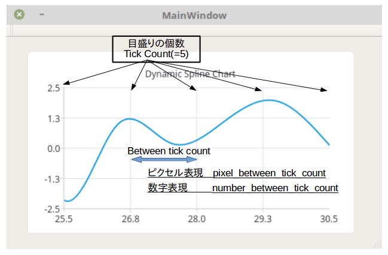

具体的には，下記のコードを４８行目くらいに貼り付けてください．

```cpp
void MainWindow::handleTimeout()
{
    //Pixels between one tick and another tick
    qreal pixel_between_tick_count = ui->my_chart_view->chart()->plotArea().width() / this->axis->tickCount();

    //Number between one tick and another tick
    qreal number_between_tick_count = (this->axis->max() - this->axis->min()) / this->axis->tickCount();

    //Scroll next x of (x,y)
    this->x += number_between_tick_count;
    qDebug() << " (x, y) = " << this->x << " , " << this->y;

    //Make random number for next y of (x,y)
    std::random_device rnd;
    std::uniform_real_distribution<> rand_d(-2.5, 2.5);
    this->y = rand_d(rnd);

    //Added next data (x, y) to series class
    this->series->append(this->x, this->y);

    //Scroll one tick which is represented by pixel
    ui->my_chart_view->chart()->scroll(pixel_between_tick_count, 0);

    //After 100 times modified, timer will be stoped
    if (this->x >= 30)
    {
        this->timer->stop();
    }
}

```

## main.cpp
特にやることもないのですが，メインウィンドウの大きさを(500,300)に変更しておきましょう．
具体的には８行目に下記のコードを貼り付けてください．
```cpp
w.setFixedSize(500,300);
```

うまく貼り付けられると下記のようなコードが出来上がっているはずです．
```cpp
#include "mainwindow.h"
#include <QApplication>

int main(int argc, char *argv[])
{
    QApplication a(argc, argv);
    MainWindow w;
    w.setFixedSize(500, 300);
    w.show();

    return a.exec();
}

```

## 付録（完成コード）
### sc_chart.pro
```cpp
#-------------------------------------------------
#
# Project created by QtCreator 2018-05-26T13:25:19
#
#-------------------------------------------------

QT       += core gui charts

greaterThan(QT_MAJOR_VERSION, 4): QT += widgets

TARGET = sc_chart
TEMPLATE = app

# The following define makes your compiler emit warnings if you use
# any feature of Qt which has been marked as deprecated (the exact warnings
# depend on your compiler). Please consult the documentation of the
# deprecated API in order to know how to port your code away from it.
DEFINES += QT_DEPRECATED_WARNINGS

# You can also make your code fail to compile if you use deprecated APIs.
# In order to do so, uncomment the following line.
# You can also select to disable deprecated APIs only up to a certain version of Qt.
#DEFINES += QT_DISABLE_DEPRECATED_BEFORE=0x060000    # disables all the APIs deprecated before Qt 6.0.0


SOURCES += \
        main.cpp \
        mainwindow.cpp

HEADERS += \
        mainwindow.h

FORMS += \
        mainwindow.ui

```

## mainwindow.h
```cpp
#ifndef MAINWINDOW_H
#define MAINWINDOW_H

#include <QtCharts/QChartView>
#include <QtCharts/QSplineSeries>
#include <QtCharts/QValueAxis>
#include <QtCore/QTimer>
#include <random>

#include <QMainWindow>

namespace Ui {
class MainWindow;
}

class MainWindow : public QMainWindow
{
    Q_OBJECT

public:
    explicit MainWindow(QWidget *parent = 0);
    ~MainWindow();

private:
    Ui::MainWindow *ui; 				//Through ui class, we can handle my_chart_view, and so on.
    QTimer* timer;						//In order to use animation, timer class call handleTimeout() class method every one second.
    QtCharts::QSplineSeries* series;	//series class keep the actual datas.
    QtCharts::QValueAxis* axis;			//The information regarding to x axis.
    qreal x;							//x of next (x,y)
    qreal y;							//y of next (x,y)

public slots:
    void handleTimeout();
};

#endif // MAINWINDOW_H

```

## main.cpp
```cpp
#include "mainwindow.h"
#include <QApplication>

int main(int argc, char *argv[])
{
    QApplication a(argc, argv);
    MainWindow w;
    w.setFixedSize(500, 300);
    w.show();

    return a.exec();
}

```

## mainwindow.cpp
```cpp
#include "mainwindow.h"
#include "ui_mainwindow.h"

MainWindow::MainWindow(QWidget *parent) :
    QMainWindow(parent),
    ui(new Ui::MainWindow)
{
    ui->setupUi(this);

    //Initialize
    this->axis 		   = new QtCharts::QValueAxis();
    this->series       = new QtCharts::QSplineSeries();
    this->timer        = new QTimer();
    this->x            = 2.5;
    this->y            = 2.5;

    //Set initial data to series and set series class to chart class
    this->series->append(this->x, this->y);
    ui->my_chart_view->chart()->addSeries(this->series);

    //Set config of axis
    ui->my_chart_view->chart()->createDefaultAxes();
    ui->my_chart_view->chart()->setAxisX(this->axis, this->series);
    this->axis->setTickCount(5);
    ui->my_chart_view->chart()->axisX()->setRange(-2.5, 2.5);
    ui->my_chart_view->chart()->axisY()->setRange(-2.5, 2.5);

    //Set title, legend  and animation config
    ui->my_chart_view->chart()->setTitle("Dynamic Spline Chart");
    ui->my_chart_view->chart()->legend()->hide();
    ui->my_chart_view->chart()->setAnimationOptions(QChart::AllAnimations);
    ui->my_chart_view->setRenderHint(QPainter::Antialiasing);

    //Set timer and start
    QObject::connect(this->timer, &QTimer::timeout, this, &MainWindow::handleTimeout);
    this->timer->setInterval(1000);
    this->timer->start();

}

MainWindow::~MainWindow()
{
    delete ui;
}

void MainWindow::handleTimeout()
{
    //Pixels between one tick and another tick
    qreal pixel_between_tick_count = ui->my_chart_view->chart()->plotArea().width() / this->axis->tickCount();

    //Number between one tick and another tick
    qreal number_between_tick_count = (this->axis->max() - this->axis->min()) / this->axis->tickCount();

    //Scroll next x of (x,y)
    this->x += number_between_tick_count;
    qDebug() << " (x, y) = " << this->x << " , " << this->y;

    //Make random number for next y of (x,y)
    std::random_device rnd;
    std::uniform_real_distribution<> rand_d(-2.5, 2.5);
    this->y = rand_d(rnd);

    //Added next data (x, y) to series class
    this->series->append(this->x, this->y);

    //Scroll one tick which is represented by pixel
    ui->my_chart_view->chart()->scroll(pixel_between_tick_count, 0);

    //After 100 times modified, timer will be stoped
    if (this->x >= 30)
    {
        this->timer->stop();
    }
}

```
